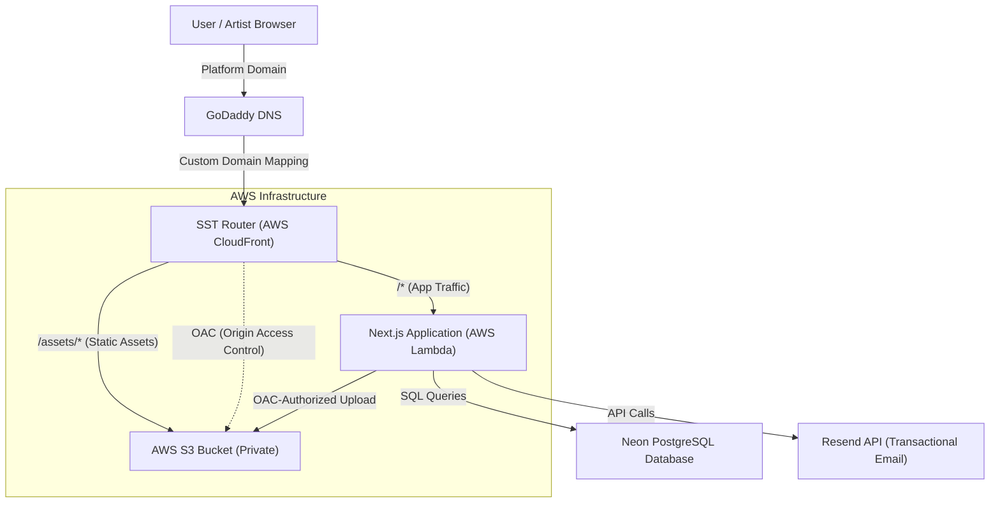

# Galerie Varinchie - Artist Platform

Welcome to the Galerie Varinchie platform. This curated statement-art gallery is designed for high-availability, secure asset management, and seamless administrative control.

---

## 1. Client Administration & System Access Guide

This section provides a direct, professional guide for the business owner to manage the platform's infrastructure and data.

### 1.1 Administrative Access Points
The platform's data and infrastructure are managed through the following third-party services:

*   **Neon**: Housing the primary database, which contains all user records, artist profiles, product inventory, and transaction history.
*   **Amazon Web Services (AWS)**: Providing the core hosting infrastructure (Lambda), private file storage (S3), and global content delivery (CloudFront).
*   **GoDaddy**: Managing the custom business domain and directing incoming traffic to the AWS infrastructure via DNS records.
*   **Resend**: Controlling the transactional email pipeline for authenticating users and sending customer notifications.

### 1.2 The Operational Workflow
When an artist submits a work, the system executes the following literal path of data:
1.  **Submission**: Data and image files are uploaded through the platform's interface.
2.  **Storage**: Image files are automatically transmitted to a secure, private folder within **AWS S3**.
3.  **Distribution**: The platform's database records the new entry, and **AWS CloudFront** serves the images to customers globally, ensuring fast load times and optimized delivery.

### 1.3 Data Management
The Neon database serves as the definitive "source of truth" for the business. While the application's admin interface handles most day-to-day tasks, manual corrections to product statuses, user roles, or transaction records can be performed directly within the **Neon SQL console** by an authorized administrator if necessary.

### 1.4 Asset Security
The system implements **Origin Access Control (OAC)** to ensure intellectual property protection. This means that image files stored in S3 are not publicly accessible via direct links. Only the application's authorized CloudFront distribution has the necessary permissions to retrieve and serve these files, effectively preventing unauthorized hotlinking or direct harvesting of your assets.

### 1.5 Emergency Procedures
The **GoDaddy DNS settings** are the critical link between your domain name and the AWS infrastructure. These records are stable and should only be modified during a total environment migration or extreme disaster recovery scenario. Unauthorized changes here will result in immediate website downtime.

---

## 2. Infrastructure & Deployment

The platform is built on a modern, serverless architecture using **SST (Ion)** and **Amazon Web Services (AWS)** to ensure high availability, security, and cost-efficiency.

### 2.1 Architecture Overview



*   **Next.js on AWS Lambda**: The core application logic and server-side rendering (SSR) are hosted on AWS Lambda, allowing the system to scale automatically.
*   **Edge Delivery via CloudFront**: Global content delivery is managed through AWS CloudFront (CDN), ensuring low-latency access.
*   **Managed Database**: The application uses **Neon**, a serverless PostgreSQL database with efficient connection pooling and branching capabilities.
*   **Transactional Email**: **Resend** is integrated via its high-performance API to handle all transactional communications (OTP codes, order confirmations).

---

## 3. Data Architecture

The platform utilizes a structured relational database schema managed via the **Drizzle ORM**.

### 3.1 Core Entities & Relationships

| Table | Description | Key Relationships |
| :--- | :--- | :--- |
| **User** | Central identity store for all platform participants. | Relates to Artist Profile, Session, and Orders. |
| **Artist Profile** | Extended metadata for artist applicants and approved vendors. | Owned by a User; relates to Art Requests. |
| **Art Request** | Staging table for works submitted by artists for administrative review. | Belongs to an Artist Profile. |
| **Product** | The live "source of truth" for items available on the storefront. | Associated with Sub Category. |
| **Category / Sub Category** | Multi-level taxonomy for product organization and discovery. | Organizes Products and Art Requests. |
| **Order / Order Item** | Records of finalized transactions and the specific pieces purchased. | Relates User to Products. |
| **Cart / Wishlist** | Persistent storage for user engagement and shopping intent. | Relates User to Products. |
| **OTP Token / Session** | Secure infrastructure for passwordless auth and active session tracking. | Ensures User security. |
| **Testimonial** | User-generated reviews for specific artwork pieces. | Relates User and Product. |

---

## 4. Core Workflows

*   **Artist Onboarding**: User submits an Artist Profile -> enters `PENDING` -> Admin approval transitions to `APPROVED`, enabling artwork submissions.
*   **Product Publication**: Approved artist submits an Art Request -> Admin review of imagery/specs -> Upon approval, a new Product entry is generated for the storefront.

---

## 5. Developer Setup & Deployment

### 5.1 Local Development
1. **Install Dependencies**: `npm install`
2. **Setup Secrets**: Use `sst secret set <NAME> <VALUE>` to configure `DATABASE_URL`, `JWT_SECRET`, and `RESEND_API_KEY`.
3. **Run Dev Server**: `npm run dev`
4. **Database Management**: Use `npm run db:push` to sync schema changes to Neon.

### 5.2 Deployment
Deploy to the production environment:
```bash
npm run deploy
```

---

## 6. Administrative Controls

To access the administration panel, log in as an authorized admin.

*   **Taxonomy Management**: Create and manage Categories and Sub-Categories via the web interface.
*   **Artist Review**: Review profiles and artwork submissions within the central admin dashboard.
*   **Order Tracking**: Export order history as CSV for logistics and reporting.
